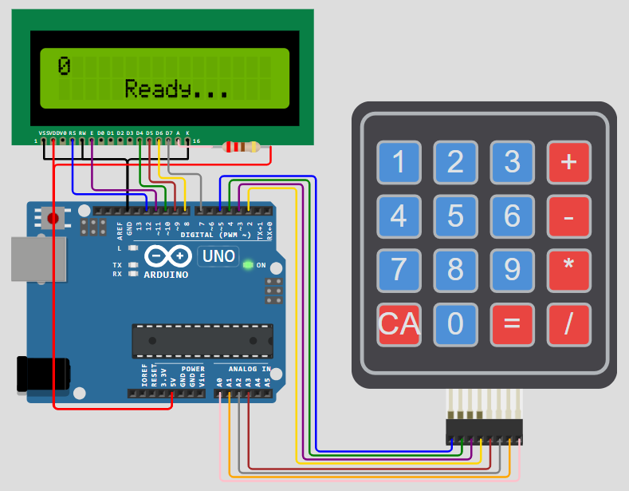
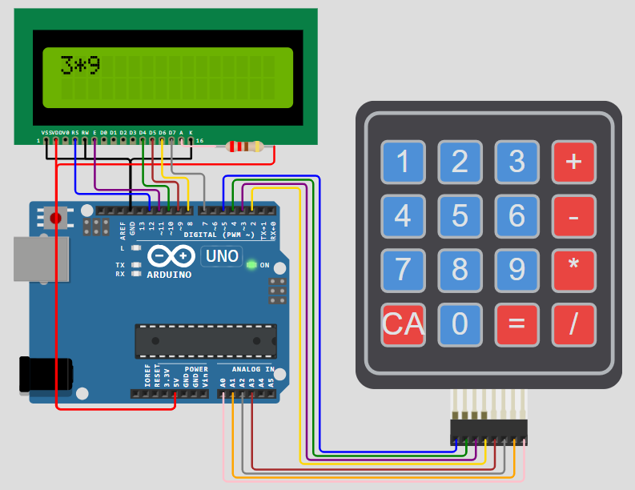
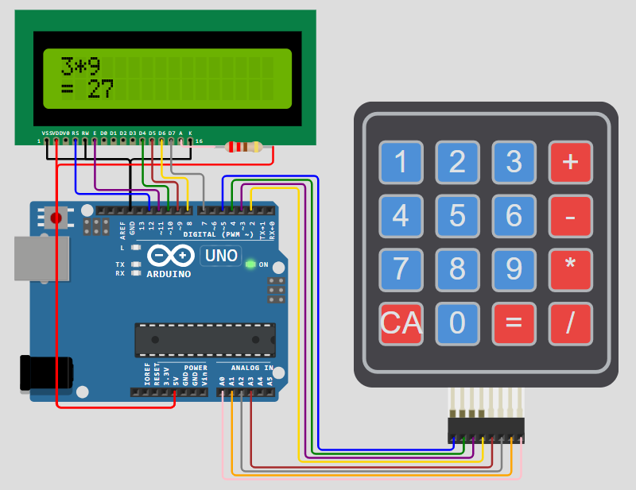

# Arduino Calculator — 4×4 Keypad + 16×2 LCD

A fully functional hardware calculator built on **Arduino Uno** using a **4×4 matrix keypad** for input and a **16×2 LCD** for real-time expression display and result output.

---

## Demo

| Idle / Ready | Expression Input | Result Display |
|---|---|---|
|  |  |  |

---

## Features

- **Real-time expression display** — shows full `operand operator operand` expression on LCD row 1
- **Arithmetic operations** — Addition (`+`), Subtraction (`-`), Multiplication (`*`), Division (`/`)
- **Result on row 2** — displays `= result` instantly on `=` press
- **Error handling** — Division by zero and numeric overflow detected with descriptive LCD messages
- **Clear All (`C`)** — resets state with a "Cleared!" confirmation message
- **Splash screen** — animated "Divyanshu's Calculator" intro on power-up
- **Blinking cursor** — real-time cursor feedback using `millis()`-based non-blocking toggle
- **Result chaining** — result of one calculation can be directly used as input for the next
- **16-char display truncation** — long expressions scroll from the left without crashing

---

## Hardware

| Component | Specification |
|---|---|
| Microcontroller | Arduino Uno (ATmega328P) |
| Keypad | 4×4 Matrix Keypad |
| Display | 16×2 LCD (parallel interface) |
| Resistor | 220Ω (LCD backlight current limiting) |

---

## Pin Connections

### LCD → Arduino
| LCD Pin | Arduino Pin |
|---|---|
| RS | D12 |
| E  | D11 |
| D4 | D10 |
| D5 | D9  |
| D6 | D8  |
| D7 | D7  |
| VSS, RW, K | GND |
| VDD, A | 5V (via 220Ω for backlight) |

### Keypad → Arduino
| Keypad | Arduino |
|---|---|
| Row 1–4 | D5, D4, D3, D2 |
| Col 1–4 | A3, A2, A1, A0 |

---

## Keypad Layout

```
[ 1 ] [ 2 ] [ 3 ] [ + ]
[ 4 ] [ 5 ] [ 6 ] [ - ]
[ 7 ] [ 8 ] [ 9 ] [ * ]
[ C ] [ 0 ] [ = ] [ / ]
```

---

## Software

### Libraries Used
| Library | Purpose |
|---|---|
| `LiquidCrystal.h` | LCD control (built-in Arduino) |
| `Keypad.h` | 4×4 matrix keypad scanning |

Install `Keypad` library via Arduino IDE: **Tools → Manage Libraries → search "Keypad" by Mark Stanley**

### Key Implementation Details

- **Matrix scanning** — keypad rows driven via digital pins, columns read via analog pins configured as digital inputs
- **Expression parser** — `memory` stores left operand, `current` stores right operand; `operation` stores pending operator as `char`
- **Non-blocking cursor blink** — `millis() / 400 % 2` toggles `lcd.cursor()` / `lcd.noCursor()` without `delay()`
- **Float formatting** — integer results displayed without decimal; float results shown to 3 decimal places
- **Input limit** — max 9 digits per operand to prevent buffer overflow

---

## How to Run

1. Clone this repository:
   ```bash
   git clone https://github.com/Divyanshukumar2005/Arduino-Calculator.git
   ```
2. Open `calculator.ino` in **Arduino IDE**
3. Install the `Keypad` library (see above)
4. Connect hardware as per pin table
5. Upload to Arduino Uno — done!

---

## Project Structure

```
Arduino-Calculator/
├── calculator.ino       # Main source code
├── README.md            # This file
└── screenshots/         # Demo images
    ├── ready.png
    ├── input.png
    └── result.png
```

---

## Author

**Divyanshu Kumar**  
B.Tech ECE, Faculty of Technology, University of Delhi  
[LinkedIn](https://www.linkedin.com/in/divyanshu-kumar-7625a8315) · [GitHub](https://github.com/Divyanshukumar2005)
